# Analysis of integration site distributions and relative clonal abundance for subject pFR03

Feb 08 2017


***
<P style="page-break-before: always">
## Introduction

The attached report describes results of analysis of integration site
distributions and relative abundance for samples from gene therapy trials. For
cases of gene correction in circulating blood cells, it is possible to harvest
cells sequentially from blood to monitor cell populations. Frequency of
isolation information can provide information on the clonal structure of the
population. This report summarizes results for subject pFR03
over time points m12 in UCSC genome
draft hg18.

The samples studied in this report, the numbers of sequence reads, recovered
integration vectors, and unique integration sites available for this subject
are shown below. We quantify population clone diversity using [Gini
coefficients](https://en.wikipedia.org/wiki/Gini_coefficient), [Shannon
index](https://en.wikipedia.org/wiki/Diversity_index#Shannon_index), and UC50. The Gini
coefficient provides a measure of inequality in clonal abundance in each
sample. The coefficient equals zero when all sites are equally abundant
(polyclonal) and increases as fewer sites account for more of the total
(oligoclonal). Shannon index is another widely used measure of diversity and it
accounts for both abundance and evenness of the integration events. Alternatively, the
UC50 is the number of unique clones which make up the top 50% of the sample's abundance.
For polyclonal samples, one may expect a low Gini coefficient, high Shannon Index, and
high UC50 (proportional to the total number of unique sites identified in the sample).

Under most circumstances only a subset of sites will be sampled. We thus
include an estimate of sample size based on frequency of isolation information
from the SonicLength method [(Berry, 2012)](http://www.ncbi.nlm.nih.gov/pubmed/22238265).
The 'S.chao1' column denotes the estimated lower bound for population size derived using Chao
estimate [(Chao, 1987)](http://www.ncbi.nlm.nih.gov/pubmed/3427163). If sample
replicates were present then estimates were subjected to jackknife bias
correction.

<table>
<caption>Sample Summary Table</caption>
 <thead>
  <tr>
   <th style="text-align:left;"> Trial </th>
   <th style="text-align:left;"> GTSP </th>
   <th style="text-align:right;"> Replicates </th>
   <th style="text-align:left;"> Patient </th>
   <th style="text-align:left;"> Timepoint </th>
   <th style="text-align:left;"> CellType </th>
   <th style="text-align:right;"> TotalReads </th>
   <th style="text-align:right;"> InferredCells </th>
   <th style="text-align:right;"> UniqueSites </th>
   <th style="text-align:left;"> FragMethod </th>
   <th style="text-align:right;"> VCN </th>
   <th style="text-align:right;"> S.chao1 </th>
   <th style="text-align:right;"> Gini </th>
   <th style="text-align:right;"> Shannon </th>
   <th style="text-align:right;"> UC50 </th>
  </tr>
 </thead>
<tbody>
  <tr>
   <td style="text-align:left;"> WAS </td>
   <td style="text-align:left;"> GTSP0311 </td>
   <td style="text-align:right;"> 4 </td>
   <td style="text-align:left;"> pFR03 </td>
   <td style="text-align:left;"> m12 </td>
   <td style="text-align:left;"> Bcells </td>
   <td style="text-align:right;"> 367097 </td>
   <td style="text-align:right;"> 19076 </td>
   <td style="text-align:right;"> 5661 </td>
   <td style="text-align:left;"> Fragmentase </td>
   <td style="text-align:right;"> 0.82 </td>
   <td style="text-align:right;"> 9477 </td>
   <td style="text-align:right;"> 0.5879 </td>
   <td style="text-align:right;"> 7.8066 </td>
   <td style="text-align:right;"> 523 </td>
  </tr>
  <tr>
   <td style="text-align:left;"> WAS </td>
   <td style="text-align:left;"> GTSP0309 </td>
   <td style="text-align:right;"> 4 </td>
   <td style="text-align:left;"> pFR03 </td>
   <td style="text-align:left;"> m12 </td>
   <td style="text-align:left;"> Monocytes </td>
   <td style="text-align:right;"> 175225 </td>
   <td style="text-align:right;"> 3707 </td>
   <td style="text-align:right;"> 1284 </td>
   <td style="text-align:left;"> Fragmentase </td>
   <td style="text-align:right;"> 0.42 </td>
   <td style="text-align:right;"> 2382 </td>
   <td style="text-align:right;"> 0.5088 </td>
   <td style="text-align:right;"> 6.6443 </td>
   <td style="text-align:right;"> 200 </td>
  </tr>
  <tr>
   <td style="text-align:left;"> WAS </td>
   <td style="text-align:left;"> GTSP0310 </td>
   <td style="text-align:right;"> 4 </td>
   <td style="text-align:left;"> pFR03 </td>
   <td style="text-align:left;"> m12 </td>
   <td style="text-align:left;"> Neutrophils </td>
   <td style="text-align:right;"> 479745 </td>
   <td style="text-align:right;"> 17591 </td>
   <td style="text-align:right;"> 2858 </td>
   <td style="text-align:left;"> Fragmentase </td>
   <td style="text-align:right;"> 0.48 </td>
   <td style="text-align:right;"> 4535 </td>
   <td style="text-align:right;"> 0.6268 </td>
   <td style="text-align:right;"> 7.1428 </td>
   <td style="text-align:right;"> 277 </td>
  </tr>
  <tr>
   <td style="text-align:left;"> WAS </td>
   <td style="text-align:left;"> GTSP0312 </td>
   <td style="text-align:right;"> 4 </td>
   <td style="text-align:left;"> pFR03 </td>
   <td style="text-align:left;"> m12 </td>
   <td style="text-align:left;"> NKcells </td>
   <td style="text-align:right;"> 383953 </td>
   <td style="text-align:right;"> 8770 </td>
   <td style="text-align:right;"> 2963 </td>
   <td style="text-align:left;"> Fragmentase </td>
   <td style="text-align:right;"> 0.76 </td>
   <td style="text-align:right;"> 5705 </td>
   <td style="text-align:right;"> 0.5306 </td>
   <td style="text-align:right;"> 7.4083 </td>
   <td style="text-align:right;"> 410 </td>
  </tr>
  <tr>
   <td style="text-align:left;"> WAS </td>
   <td style="text-align:left;"> GTSP0308 </td>
   <td style="text-align:right;"> 4 </td>
   <td style="text-align:left;"> pFR03 </td>
   <td style="text-align:left;"> m12 </td>
   <td style="text-align:left;"> Tcells </td>
   <td style="text-align:right;"> 639334 </td>
   <td style="text-align:right;"> 36141 </td>
   <td style="text-align:right;"> 14298 </td>
   <td style="text-align:left;"> Fragmentase </td>
   <td style="text-align:right;"> 1.55 </td>
   <td style="text-align:right;"> 24183 </td>
   <td style="text-align:right;"> 0.4975 </td>
   <td style="text-align:right;"> 8.9138 </td>
   <td style="text-align:right;"> 2090 </td>
  </tr>
</tbody>
</table>


***
<P style="page-break-before: always">
## Do any uniquely mapped clones account for greater than 20% of the total?
For some trials, a reporting criteria is whether any cell clones expand to account for greater than 20% of all clones. This is summarized below for subject pFR03. Abundance is estimated using the SonicLength method. Data such as this must, of course, be interpreted in the context of results from other assays. Distances reported refer to transcription start sites (5').

<strong>No sites found in this patient which are greater than 20% of the total data.</strong>

## Do any multihit event account for greater than 20% of the total?

Up until now, all the analysis has been looking at integration sites that can be uniquely mapped. But it is also helpful to look at reads finding multiple equally good alignments in the genome which can be reffered to as 'Multihits'. If an integration site occurred within a repeat element (i.e. Alus, LINE, SINE, etc), then it might be helpful to access those sites for potential detrimental effects. These collection of sequences are analyzed separately due to their ambiguity. To make some sense of these multihits, we bin any sequence(s) which share 1 or more genomic locations hence forming psuedo-collections which can be reffered to as OTUs (operation taxonomic units). Once the OTUs are formed, we compare breakpoints of unique sites and multihits. The idea is to see if there are any multihits which higher in abundance than a unique site in a given sample. Below is a table similar to the one shown previously except we show any events instead of genomic locations which might account for greater than 20% of all clones in the data.

<strong>No multihits sites found in this patient which are greater than 20% of the total data.</strong>

***
<P style="page-break-before: always">
## Relative abundance of cell clones

The relative abundance of cell clones is summarized in the attached stacked bar graphs.  The cell fraction studied is named at the top, the time points are marked at the bottom. The different bars in each panel show the major cell clones, as marked by integration sites.  A key to the sites is shown at the right. Throughout the whole report, each integration site is assigned a ```GeneName``` given by:

<font face="Courier" color="#333399">
 - ```GeneName``` refers to the closest gene to either end and strand,  
 - __*__  indicates the site is within a transcription unit,  
 - __~__  indicates the site is within 50kb of a cancer related gene,  
 - __!__  indicates the gene was assocaited with lymphoma in humans.  
</font>

Integration sites were recovered using ligation mediated PCR after random fragmentation of genomic DNA, which reduces recovery biases compared with restriction enzyme cleavage. Relative abundance was not measured from read counts, which are known to be inaccurate, but from marks introduced into DNA specimens prior to PCR amplification using the SonicLength method [PMID:22238265](http://www.ncbi.nlm.nih.gov/pubmed/22238265).

In the barplots below, the x-axis indicates each sample type and time point, the y-axis is scaled by the number of cells sampled (SonicBreaks), where the range is taken from the most abundant sample.  The top 10 sites from each cell type have been named for the nearest gene and pooled over all cell types. The remaining sites are binned as low abundance (LowAbund; grey).

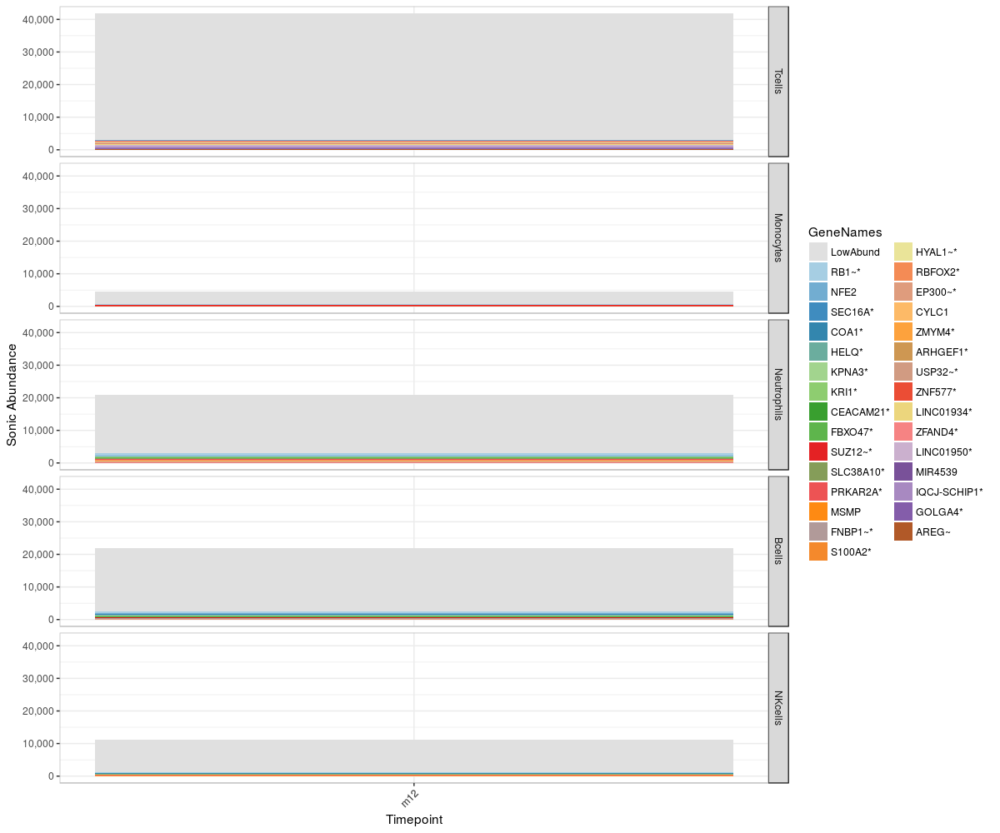

***
<P style="page-break-before: always">
Below are similar barplots to the previous figure, but the y-axis is scaled by proportion of the total, not number of cells sampled.  Comparison to the plot above helps distinguish samples with low yield of integration sites from samples with high yield and clonal expansions.  The key indicates the 10 most abundant clones in each sample. Cutoff values for binning clones as LowAbund (grey) are indicated at the top of each panel.

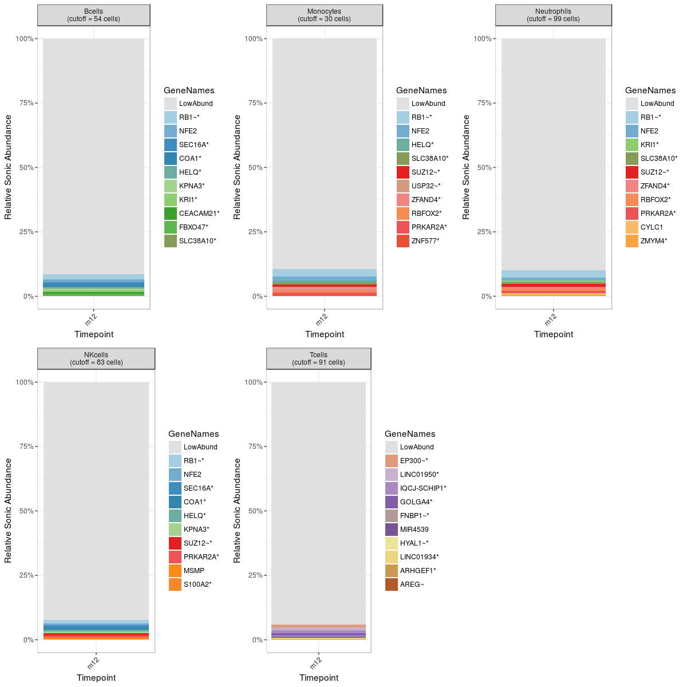
***
<P style="page-break-before: always">
Here is another way to perceive top ranking integration sites by genes within each celltype.  Any sites with Estimated Absolute Abundance below 67 are binned as LowAbund.

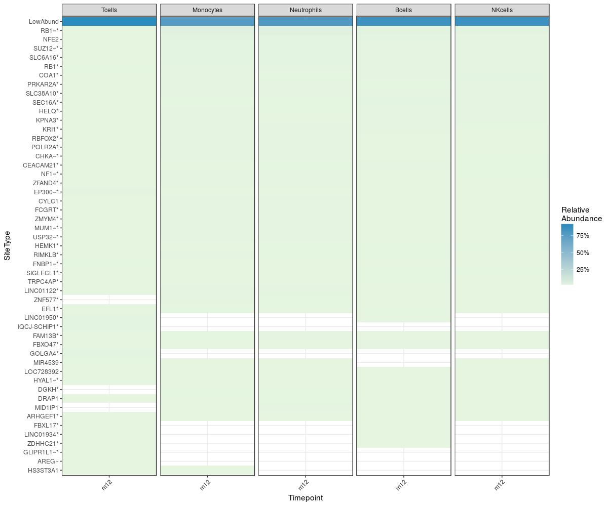

***
<P style="page-break-before: always">
## Longitudinal behavior of major clones

When multiple time points are available, it is of interest to track the behavior of the most abundant clones.  A plot of the relative abundances of major clones, based on output from SonicLength, is shown below. For cases where only a single time point is available, the data is just plotted as unlinked points.

**Only one timepoint, , present.  Insufficient data available to plot changes of clone densities across timepoints.**

***
<P style="page-break-before: always">
## Integration sites near particular genes of interest

Integration sites near genes that have been associated with adverse events are of particular interest. Thus, we have cataloged all integration sites for which a gene of interest is the nearest cancer-related gene.
Results are summarized below as a scatter plot where the y-axis shows relative abundance of sites and x-axis is distance to the nearest onconogene 5' end.

Negative distances indicate that the integration site is downstream from (i.e. after) the TSS.  Positive distances indicate that the integration site is upstream from (i.e. before) the TSS.  Note that all RefSeq splicing isoforms are used for this analysis, so the reference TSS may not be the same for each listed integration site.


### LMO2
 **No sites within 100kb of any LMO2 TSS for this patient.**


### IKZF1
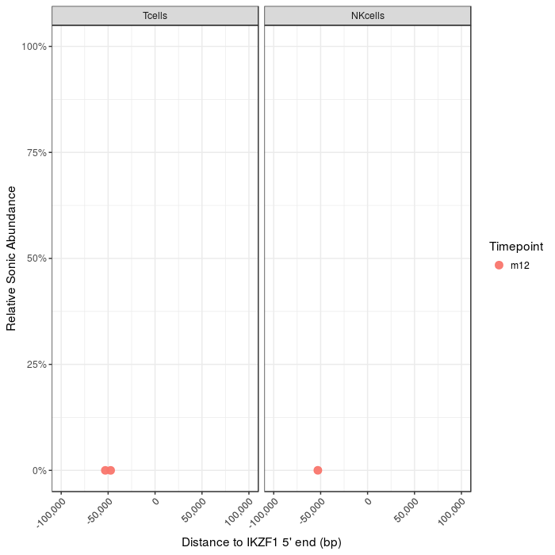<table>
<caption>IKZF1 sites</caption>
 <thead>
  <tr>
   <th style="text-align:left;"> Timepoint </th>
   <th style="text-align:left;"> CellType </th>
   <th style="text-align:left;"> Integration Site </th>
   <th style="text-align:left;"> nearestOnco </th>
   <th style="text-align:right;"> distToNearestOnco </th>
   <th style="text-align:right;"> sonicAbundance </th>
   <th style="text-align:right;"> sonicAbundanceRank </th>
  </tr>
 </thead>
<tbody>
  <tr>
   <td style="text-align:left;"> m12 </td>
   <td style="text-align:left;"> Tcells </td>
   <td style="text-align:left;"> chr7+50266913 </td>
   <td style="text-align:left;"> IKZF1 </td>
   <td style="text-align:right;"> -47311 </td>
   <td style="text-align:right;"> 1 </td>
   <td style="text-align:right;"> 14298 </td>
  </tr>
  <tr>
   <td style="text-align:left;"> m12 </td>
   <td style="text-align:left;"> Tcells </td>
   <td style="text-align:left;"> chr7-50261246 </td>
   <td style="text-align:left;"> IKZF1 </td>
   <td style="text-align:right;"> -52978 </td>
   <td style="text-align:right;"> 3 </td>
   <td style="text-align:right;"> 4491 </td>
  </tr>
  <tr>
   <td style="text-align:left;"> m12 </td>
   <td style="text-align:left;"> NKcells </td>
   <td style="text-align:left;"> chr7-50261246 </td>
   <td style="text-align:left;"> IKZF1 </td>
   <td style="text-align:right;"> -52978 </td>
   <td style="text-align:right;"> 2 </td>
   <td style="text-align:right;"> 1771 </td>
  </tr>
</tbody>
</table>
***

### CCND2
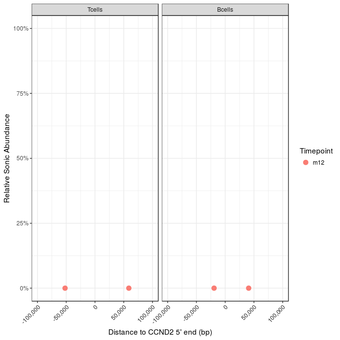<table>
<caption>CCND2 sites</caption>
 <thead>
  <tr>
   <th style="text-align:left;"> Timepoint </th>
   <th style="text-align:left;"> CellType </th>
   <th style="text-align:left;"> Integration Site </th>
   <th style="text-align:left;"> nearestOnco </th>
   <th style="text-align:right;"> distToNearestOnco </th>
   <th style="text-align:right;"> sonicAbundance </th>
   <th style="text-align:right;"> sonicAbundanceRank </th>
  </tr>
 </thead>
<tbody>
  <tr>
   <td style="text-align:left;"> m12 </td>
   <td style="text-align:left;"> Tcells </td>
   <td style="text-align:left;"> chr12+4201102 </td>
   <td style="text-align:left;"> CCND2 </td>
   <td style="text-align:right;"> -52060 </td>
   <td style="text-align:right;"> 2 </td>
   <td style="text-align:right;"> 7788 </td>
  </tr>
  <tr>
   <td style="text-align:left;"> m12 </td>
   <td style="text-align:left;"> Tcells </td>
   <td style="text-align:left;"> chr12-4312016 </td>
   <td style="text-align:left;"> CCND2 </td>
   <td style="text-align:right;"> 58854 </td>
   <td style="text-align:right;"> 2 </td>
   <td style="text-align:right;"> 7788 </td>
  </tr>
  <tr>
   <td style="text-align:left;"> m12 </td>
   <td style="text-align:left;"> Bcells </td>
   <td style="text-align:left;"> chr12+4233836 </td>
   <td style="text-align:left;"> CCND2 </td>
   <td style="text-align:right;"> -19326 </td>
   <td style="text-align:right;"> 2 </td>
   <td style="text-align:right;"> 3128 </td>
  </tr>
  <tr>
   <td style="text-align:left;"> m12 </td>
   <td style="text-align:left;"> Bcells </td>
   <td style="text-align:left;"> chr12+4294003 </td>
   <td style="text-align:left;"> CCND2 </td>
   <td style="text-align:right;"> 40841 </td>
   <td style="text-align:right;"> 2 </td>
   <td style="text-align:right;"> 3128 </td>
  </tr>
</tbody>
</table>
***

### HMGA2
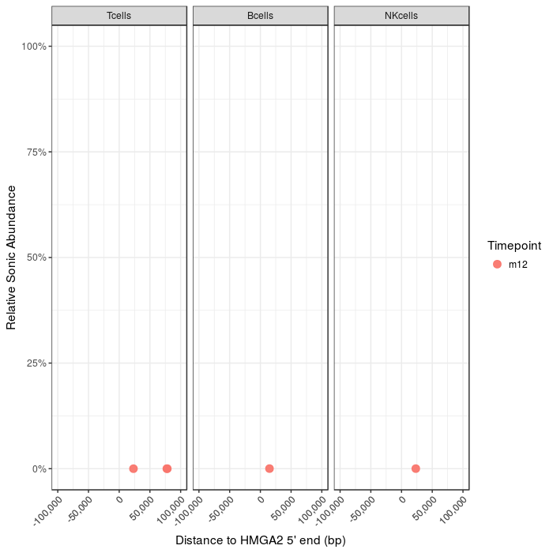<table>
<caption>HMGA2 sites</caption>
 <thead>
  <tr>
   <th style="text-align:left;"> Timepoint </th>
   <th style="text-align:left;"> CellType </th>
   <th style="text-align:left;"> Integration Site </th>
   <th style="text-align:left;"> nearestOnco </th>
   <th style="text-align:right;"> distToNearestOnco </th>
   <th style="text-align:right;"> sonicAbundance </th>
   <th style="text-align:right;"> sonicAbundanceRank </th>
  </tr>
 </thead>
<tbody>
  <tr>
   <td style="text-align:left;"> m12 </td>
   <td style="text-align:left;"> Tcells </td>
   <td style="text-align:left;"> chr12+64527707 </td>
   <td style="text-align:left;"> HMGA2 </td>
   <td style="text-align:right;"> 23201 </td>
   <td style="text-align:right;"> 1 </td>
   <td style="text-align:right;"> 14298 </td>
  </tr>
  <tr>
   <td style="text-align:left;"> m12 </td>
   <td style="text-align:left;"> Tcells </td>
   <td style="text-align:left;"> chr12-64582054 </td>
   <td style="text-align:left;"> HMGA2 </td>
   <td style="text-align:right;"> 77548 </td>
   <td style="text-align:right;"> 1 </td>
   <td style="text-align:right;"> 14298 </td>
  </tr>
  <tr>
   <td style="text-align:left;"> m12 </td>
   <td style="text-align:left;"> Tcells </td>
   <td style="text-align:left;"> chr12-64582804 </td>
   <td style="text-align:left;"> HMGA2 </td>
   <td style="text-align:right;"> 78298 </td>
   <td style="text-align:right;"> 2 </td>
   <td style="text-align:right;"> 7788 </td>
  </tr>
  <tr>
   <td style="text-align:left;"> m12 </td>
   <td style="text-align:left;"> Bcells </td>
   <td style="text-align:left;"> chr12+64519337 </td>
   <td style="text-align:left;"> HMGA2 </td>
   <td style="text-align:right;"> 14831 </td>
   <td style="text-align:right;"> 5 </td>
   <td style="text-align:right;"> 1010 </td>
  </tr>
  <tr>
   <td style="text-align:left;"> m12 </td>
   <td style="text-align:left;"> NKcells </td>
   <td style="text-align:left;"> chr12+64527707 </td>
   <td style="text-align:left;"> HMGA2 </td>
   <td style="text-align:right;"> 23201 </td>
   <td style="text-align:right;"> 2 </td>
   <td style="text-align:right;"> 1771 </td>
  </tr>
</tbody>
</table>
***

### MECOM
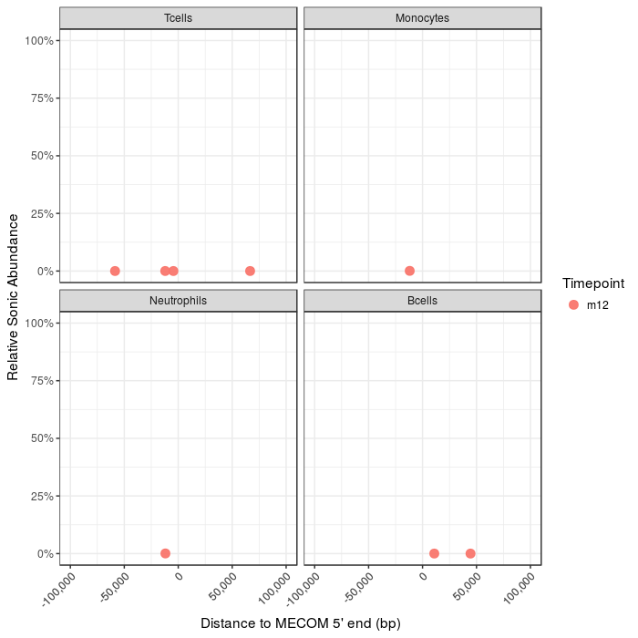<table>
<caption>MECOM sites</caption>
 <thead>
  <tr>
   <th style="text-align:left;"> Timepoint </th>
   <th style="text-align:left;"> CellType </th>
   <th style="text-align:left;"> Integration Site </th>
   <th style="text-align:left;"> nearestOnco </th>
   <th style="text-align:right;"> distToNearestOnco </th>
   <th style="text-align:right;"> sonicAbundance </th>
   <th style="text-align:right;"> sonicAbundanceRank </th>
  </tr>
 </thead>
<tbody>
  <tr>
   <td style="text-align:left;"> m12 </td>
   <td style="text-align:left;"> Tcells </td>
   <td style="text-align:left;"> chr3+170352698 </td>
   <td style="text-align:left;"> MECOM </td>
   <td style="text-align:right;"> -4482 </td>
   <td style="text-align:right;"> 1 </td>
   <td style="text-align:right;"> 14298 </td>
  </tr>
  <tr>
   <td style="text-align:left;"> m12 </td>
   <td style="text-align:left;"> Tcells </td>
   <td style="text-align:left;"> chr3+170360278 </td>
   <td style="text-align:left;"> MECOM </td>
   <td style="text-align:right;"> -12062 </td>
   <td style="text-align:right;"> 5 </td>
   <td style="text-align:right;"> 1817 </td>
  </tr>
  <tr>
   <td style="text-align:left;"> m12 </td>
   <td style="text-align:left;"> Tcells </td>
   <td style="text-align:left;"> chr3+170406788 </td>
   <td style="text-align:left;"> MECOM </td>
   <td style="text-align:right;"> -58572 </td>
   <td style="text-align:right;"> 2 </td>
   <td style="text-align:right;"> 7788 </td>
  </tr>
  <tr>
   <td style="text-align:left;"> m12 </td>
   <td style="text-align:left;"> Tcells </td>
   <td style="text-align:left;"> chr3-170797646 </td>
   <td style="text-align:left;"> MECOM </td>
   <td style="text-align:right;"> 66611 </td>
   <td style="text-align:right;"> 1 </td>
   <td style="text-align:right;"> 14298 </td>
  </tr>
  <tr>
   <td style="text-align:left;"> m12 </td>
   <td style="text-align:left;"> Monocytes </td>
   <td style="text-align:left;"> chr3+170360109 </td>
   <td style="text-align:left;"> MECOM </td>
   <td style="text-align:right;"> -11893 </td>
   <td style="text-align:right;"> 3 </td>
   <td style="text-align:right;"> 549 </td>
  </tr>
  <tr>
   <td style="text-align:left;"> m12 </td>
   <td style="text-align:left;"> Neutrophils </td>
   <td style="text-align:left;"> chr3+170360109 </td>
   <td style="text-align:left;"> MECOM </td>
   <td style="text-align:right;"> -11893 </td>
   <td style="text-align:right;"> 12 </td>
   <td style="text-align:right;"> 430 </td>
  </tr>
  <tr>
   <td style="text-align:left;"> m12 </td>
   <td style="text-align:left;"> Bcells </td>
   <td style="text-align:left;"> chr3+170302325 </td>
   <td style="text-align:left;"> MECOM </td>
   <td style="text-align:right;"> 44462 </td>
   <td style="text-align:right;"> 1 </td>
   <td style="text-align:right;"> 5661 </td>
  </tr>
  <tr>
   <td style="text-align:left;"> m12 </td>
   <td style="text-align:left;"> Bcells </td>
   <td style="text-align:left;"> chr3-170335900 </td>
   <td style="text-align:left;"> MECOM </td>
   <td style="text-align:right;"> 10887 </td>
   <td style="text-align:right;"> 3 </td>
   <td style="text-align:right;"> 1911 </td>
  </tr>
</tbody>
</table>
***

***
<P style="page-break-before: always">
## What are the most frequently occuring gene types in subject pFR03?
  

The word clouds below show the abundances of integration sites as designated by genenames for each sample. Each word cloud is labled by the timepoint, celltype, and the range of sonic abundance for the top 100 sites.


<table>
<tbody>
  <tr>
   <td style="text-align:left;"> 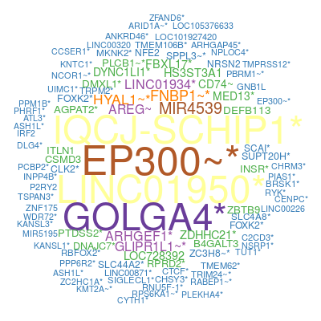 <br />m12 Tcells <strong> 24:464 </strong> </td>
   <td style="text-align:left;"> 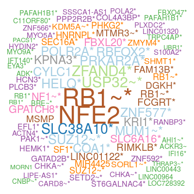 <br />m12 Monocytes <strong> 8:70 </strong> </td>
   <td style="text-align:left;"> 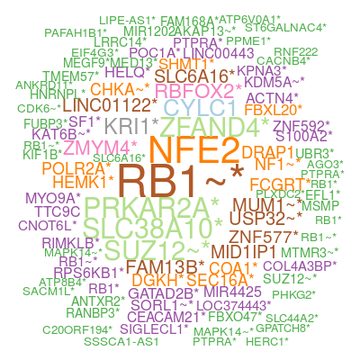 <br />m12 Neutrophils <strong> 33:321 </strong> </td>
  </tr>
  <tr>
   <td style="text-align:left;"> 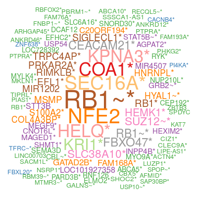 <br />m12 Bcells <strong> 26:266 </strong> </td>
   <td style="text-align:left;"> 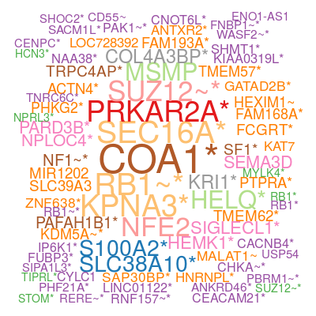 <br />m12 NKcells <strong> 15:112 </strong> </td>
   <td style="text-align:left;">  </td>
  </tr>
</tbody>
</table>
<P style="page-break-before: always">


